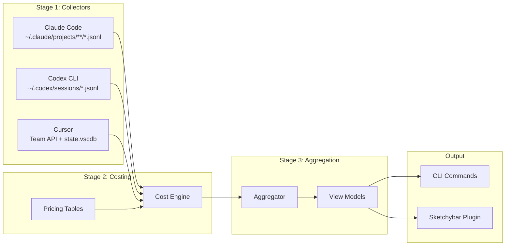

# thinktax: Multi-Provider LLM Cost Tracker

## Architecture Overview




## Core Data Model

The `UsageEvent` schema is the single source of truth:

```typescript
interface UsageEvent {
  id: string;                    // stable dedupe id
  ts: string;                    // ISO 8601 with timezone
  source: "cursor_ide" | "cursor_agent_cli" | "claude_code" | "codex_cli";
  provider: "cursor" | "anthropic" | "openai";
  model: string | null;
  tokens: { in: number; out: number; cache_write: number; cache_read: number };
  cost: {
    reported_usd: number | null;   // actual from API
    estimated_usd: number | null;  // computed from pricing
    final_usd: number | null;      // reported ?? estimated
    mode: "reported" | "estimated" | "mixed" | "unknown";
  };
  project: { id: string | null; name: string | null; root: string | null };
  meta: Record<string, unknown>;
}
```

## Storage Layout

- **Config:** `~/.config/thinktax/config.toml` (Linux) / `~/Library/Application Support/thinktax/config.toml` (macOS)
- **Data:** `~/.local/share/thinktax/` (Linux) / `~/Library/Application Support/thinktax/data/` (macOS)
  - `events/YYYY-MM-DD.jsonl` - normalized events by day
  - `snapshots/YYYY-MM-DD.summary.json` - pre-aggregated summaries
  - `state/sync.json` - high-water marks per collector
  - `state/etag.json` - Cursor API ETag cache

## Implementation Milestones

### Milestone 1: Project Scaffolding

- Initialize npm package with TypeScript, ESM, Node 20+
- Set up build tooling (tsup or similar for single-binary feel)
- Implement XDG-compliant paths module (respects Linux/macOS conventions)
- Create config loader with TOML parsing and env var interpolation

### Milestone 2: Claude Code Collector

- Discover JSONL files under `~/.claude/projects/` recursively
- Parse mixed entry types (skip `summary`, `file-history-snapshot`, etc.)
- Extract: timestamp, model, tokens (tolerant parsing for version differences)
- **Project attribution:** derive `project.id` from instance folder name, map via config rules
- Emit one `UsageEvent` per assistant turn with usage data

### Milestone 3: Codex CLI Collector

- Locate sessions via `CODEX_HOME` or `~/.codex`
- Parse JSONL session logs with **cumulative-to-delta** token conversion
- **Project attribution:** extract cwd/repo metadata from session events, fall back to nearest `.codex/config.toml`
- Optional: `codexw` wrapper script for perfect attribution via env vars

### Milestone 4: Cursor Collector (Actual Spend)

- **Primary:** Cursor Team Admin API with Basic Auth
  - Implement ETag caching (15-min TTL) in `state/etag.json`
  - Parse spending endpoints for `totalCents` / token breakdowns
  - Schema-tolerant parsing with raw response snapshots for debugging
- **Fallback 1:** Local token extraction from `state.vscdb` → private usage endpoints (config flag)
- **Fallback 2:** Estimate-only from local conversation history re-tokenization
- **Project attribution (Phase 2):** Parse `state.vscdb` for workspace history, map usage timestamps to active workspace

### Milestone 5: Costing Engine

- Pricing table: `pricing/models.json` with per-1M token rates (in/out/cache)
- Cost attribution rules:
  1. If provider returns actual cost → `reported_usd`, `final_usd = reported`
  2. Else compute estimate → `estimated_usd`, `final_usd = estimated`
- Unknown model policy: mark `mode=unknown`, exclude from totals unless `--include-unknown`
- Support Anthropic Usage API (admin key) and OpenAI Usage API for actual costs

### Milestone 6: Aggregation Engine

- Time windows: today (local midnight → now), MTD (first of month → now)
- Timezone-aware via config `ui.timezone`
- Breakdowns: by provider, source, model, project
- Cached daily summaries to avoid full rescans

### Milestone 7: CLI Commands

- `thinktax refresh` - update caches (respects ETag/min interval)
- `thinktax status [--json] [--breakdown provider|project|model] [--today] [--mtd]`
- `thinktax sketchybar [--format plain|json]` - bar label payload
- `thinktax popup [--format text|json]` - detailed breakdown for popup
- `thinktax doctor` - diagnostics (paths, env vars, API modes, staleness)

### Milestone 8: Sketchybar Integration (macOS only)

- Plugin script: `sketchybar/plugins/thinktax.sh`
  - Calls `thinktax sketchybar --format json`
  - Sets label with format: `today $X (Cursor $a / Claude $b / Codex $c)`
  - Indicators: `!` for stale, `~` for estimate-only
  - Click action opens popup
- Popup content: today totals, MTD, provider/project/model breakdowns

## Key Technical Decisions

1. **ccusage as spec, not dependency** - Implement own collectors/parsers but use ccusage for validation and test fixtures
2. **Actual-first philosophy** - `final_usd` prefers `reported_usd`; UI shows `~` prefix for estimates
3. **Project as first-class** - `project.id` (hash of git root), `project.root`, `project.name` tracked everywhere
4. **Graceful degradation** - Show last known on refresh failures; collectors work independently

## Subscription-Aware Billing (Claude Max Plan Support)

### Problem

When the user has a Claude.ai Max plan ($200/month), Claude Code sessions produce
identical JSONL logs regardless of whether the request was billed to the flat-rate
subscription (OAuth) or an API key (pay-per-token). There is **no field** in the
JSONL data that distinguishes the two. thinktax currently estimates cost at API
per-token rates for all Claude Code usage, which overcounts when tokens are covered
by the subscription.

The user's workflow: use Max plan (OAuth) until hitting rate limits, then fall back
to API key. Both can happen within a single billing period.

### Root Cause Analysis

- Claude Code JSONL entries contain: `service_tier`, `inference_geo`, token counts,
  model, requestId — but **nothing about auth method or billing mode**
- `service_tier: "standard"` for both OAuth and API key sessions
- `requestId` format (`req_0XXX...`) is identical for both
- `~/.claude/session-env/` directories exist but are all empty
- macOS Keychain stores both OAuth creds (`Claude Code-credentials`) and API key
  (`anthropic-api-key`) separately, but this isn't reflected in session logs

### Solution: SessionStart Hook + Billing Mode Registry

#### How It Works

Claude Code's `SessionStart` hook fires inside the Claude Code process environment.
The user's aliases control which auth mode is active:

```bash
# ~/.shell_aliases
alias claude='ANTHROPIC_API_KEY= command claude --dangerously-skip-permissions'     # OAuth (Max plan)
alias claude-api='command claude --dangerously-skip-permissions'                      # API key
```

When `ANTHROPIC_API_KEY` is empty/unset → OAuth/subscription. When set → API key.
The hook runs in the same process, so it sees the correct env state.

#### Component 1: SessionStart Hook Script

**File:** `~/.claude/hooks/thinktax-billing-tag.sh`

```bash
#!/bin/bash
# Tag Claude Code sessions with their billing mode for thinktax.
# Runs as a SessionStart hook inside Claude Code's process environment.
#
# Detection: ANTHROPIC_API_KEY empty → OAuth (subscription), set → API key.

SESSION_ID=$(jq -r '.session_id')
TS=$(date -u +%Y-%m-%dT%H:%M:%SZ)

if [ -z "$ANTHROPIC_API_KEY" ]; then
  MODE="subscription"
else
  MODE="api"
fi

BILLING_FILE="${XDG_CONFIG_HOME:-$HOME/.config}/thinktax/billing-sessions.jsonl"
mkdir -p "$(dirname "$BILLING_FILE")"
echo "{\"session_id\":\"$SESSION_ID\",\"billing\":\"$MODE\",\"ts\":\"$TS\"}" >> "$BILLING_FILE"
```

#### Component 2: Hook Registration

**In `~/.claude/settings.json`** (user-level, applies to all projects):

```json
{
  "hooks": {
    "SessionStart": [
      {
        "matcher": "startup",
        "hooks": [
          {
            "type": "command",
            "command": "~/.claude/hooks/thinktax-billing-tag.sh",
            "timeout": 5
          }
        ]
      }
    ]
  }
}
```

Matcher `"startup"` fires only on new sessions (not resume/clear/compact) to avoid
duplicate entries. Timeout is 5s since this is a trivial append operation.

#### Component 3: Billing Sessions Registry

**File:** `~/.config/thinktax/billing-sessions.jsonl`

```jsonl
{"session_id":"3886823c-...","billing":"subscription","ts":"2026-02-05T23:20:00Z"}
{"session_id":"a1b2c3d4-...","billing":"api","ts":"2026-02-06T01:15:00Z"}
```

#### Component 4: thinktax Config Extension

```toml
[claude.billing]
# Default billing mode for sessions without a registry entry (pre-hook sessions).
# "subscription" | "api" | "estimate"
defaultMode = "subscription"

# Monthly subscription cost (only applied when there are subscription sessions).
monthlyCost = 200.00

# Plan name for display purposes.
plan = "max"
```

#### Component 5: Claude Collector Changes

In `src/collectors/claude.ts`:

1. At collection start, load `billing-sessions.jsonl` into a `Map<sessionId, "subscription" | "api">`
2. For each JSONL file, extract `sessionId` from the first entry
3. Look up billing mode: registry hit → use it, miss → use `config.claude.billing.defaultMode`
4. Pass billing mode through to the `UsageEvent.meta.billing` field

#### Component 6: Cost Engine Changes

In `src/core/cost.ts`, `applyCosting()`:

- Add `"subscription"` to the `UsageCost.mode` union type
- When `event.meta.billing === "subscription"`:
  - Set `cost.reported_usd = 0` (no per-token charge)
  - Set `cost.estimated_usd` = normal estimate (for visibility / "what it would have cost")
  - Set `cost.final_usd = 0`
  - Set `cost.mode = "subscription"`
- When `event.meta.billing === "api"` or unset: existing behavior

#### Component 7: Aggregation & Display Changes

In `src/core/aggregate.ts`:

- Add `subscription_usd: number` to `Totals` — tracks the flat monthly cost
- Add `billing` breakdown to `SummaryBreakdowns` — groups by `"subscription"` | `"api"`
- For MTD/YTD windows that contain subscription sessions, add the configured
  `monthlyCost` to `subscription_usd` (once per calendar month)

Display format:

```
Today   $0.00 (subscription)
MTD     $245.23 (sub: $200.00 + api: $45.23)
```

### Edge Cases

| Scenario | Handling |
|---|---|
| Sessions started before hook installed | `defaultMode` config fallback (recommend `"subscription"` if currently on Max) |
| `resume` sessions | Matcher is `"startup"` only, so no duplicate entries. Resumed sessions keep original billing mode. |
| Multiple concurrent sessions | Each gets its own registry entry keyed by `session_id` |
| User switches auth mid-session | Not possible — env is locked at process start |
| Months with zero API usage | Only subscription cost shown ($200) |
| Months with zero subscription usage | Only API costs shown (no $200 added) |
| Session ID collision in registry | Last entry wins (append-only, read last match) |

### Future Enhancement: Anthropic Admin API Cross-Reference

The Anthropic Usage & Cost Admin API (`/v1/organizations/usage_report/messages`
and `/v1/organizations/cost_report`) provides actual API-billed usage data.
This could serve as a secondary verification:

- Usage appearing in the Admin API = definitely API-billed
- Usage NOT in the Admin API = subscription-covered

This requires an admin API key (`sk-ant-admin...`) and would be configured via:

```toml
[anthropic]
adminKey = "${ANTHROPIC_ADMIN_KEY}"
```

This is a Phase 2 enhancement. The hook-based approach handles the common case
without requiring additional API credentials.

## Testing Strategy

- **Unit tests:** JSONL parsing fixtures for Claude (mixed types) and Codex (cumulative→delta)
- **Integration tests:** Cursor ETag behavior, Anthropic/OpenAI usage APIs (behind env flags)
- **Boundary tests:** timezone midnight, month rollover

