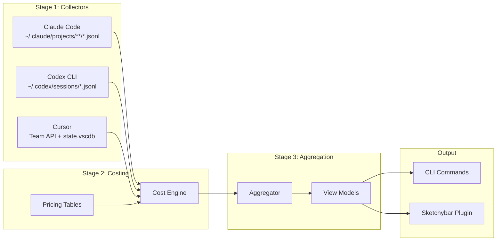

# thinktax: Multi-Provider LLM Cost Tracker

## Architecture Overview




## Core Data Model

The `UsageEvent` schema is the single source of truth:

```typescript
interface UsageEvent {
  id: string;                    // stable dedupe id
  ts: string;                    // ISO 8601 with timezone
  source: "cursor_ide" | "cursor_agent_cli" | "claude_code" | "codex_cli";
  provider: "cursor" | "anthropic" | "openai";
  model: string | null;
  tokens: { in: number; out: number; cache_write: number; cache_read: number };
  cost: {
    reported_usd: number | null;   // actual from API
    estimated_usd: number | null;  // computed from pricing
    final_usd: number | null;      // reported ?? estimated
    mode: "reported" | "estimated" | "mixed" | "unknown";
  };
  project: { id: string | null; name: string | null; root: string | null };
  meta: Record<string, unknown>;
}
```

## Storage Layout

- **Config:** `~/.config/thinktax/config.toml` (Linux) / `~/Library/Application Support/thinktax/config.toml` (macOS)
- **Data:** `~/.local/share/thinktax/` (Linux) / `~/Library/Application Support/thinktax/data/` (macOS)
  - `events/YYYY-MM-DD.jsonl` - normalized events by day
  - `snapshots/YYYY-MM-DD.summary.json` - pre-aggregated summaries
  - `state/sync.json` - high-water marks per collector
  - `state/etag.json` - Cursor API ETag cache

## Implementation Milestones

### Milestone 1: Project Scaffolding

- Initialize npm package with TypeScript, ESM, Node 20+
- Set up build tooling (tsup or similar for single-binary feel)
- Implement XDG-compliant paths module (respects Linux/macOS conventions)
- Create config loader with TOML parsing and env var interpolation

### Milestone 2: Claude Code Collector

- Discover JSONL files under `~/.claude/projects/` recursively
- Parse mixed entry types (skip `summary`, `file-history-snapshot`, etc.)
- Extract: timestamp, model, tokens (tolerant parsing for version differences)
- **Project attribution:** derive `project.id` from instance folder name, map via config rules
- Emit one `UsageEvent` per assistant turn with usage data

### Milestone 3: Codex CLI Collector

- Locate sessions via `CODEX_HOME` or `~/.codex`
- Parse JSONL session logs with **cumulative-to-delta** token conversion
- **Project attribution:** extract cwd/repo metadata from session events, fall back to nearest `.codex/config.toml`
- Optional: `codexw` wrapper script for perfect attribution via env vars

### Milestone 4: Cursor Collector (Actual Spend)

- **Primary:** Cursor Team Admin API with Basic Auth
  - Implement ETag caching (15-min TTL) in `state/etag.json`
  - Parse spending endpoints for `totalCents` / token breakdowns
  - Schema-tolerant parsing with raw response snapshots for debugging
- **Fallback 1:** Local token extraction from `state.vscdb` → private usage endpoints (config flag)
- **Fallback 2:** Estimate-only from local conversation history re-tokenization
- **Project attribution (Phase 2):** Parse `state.vscdb` for workspace history, map usage timestamps to active workspace

### Milestone 5: Costing Engine

- Pricing table: `pricing/models.json` with per-1M token rates (in/out/cache)
- Cost attribution rules:
  1. If provider returns actual cost → `reported_usd`, `final_usd = reported`
  2. Else compute estimate → `estimated_usd`, `final_usd = estimated`
- Unknown model policy: mark `mode=unknown`, exclude from totals unless `--include-unknown`
- Support Anthropic Usage API (admin key) and OpenAI Usage API for actual costs

### Milestone 6: Aggregation Engine

- Time windows: today (local midnight → now), MTD (first of month → now)
- Timezone-aware via config `ui.timezone`
- Breakdowns: by provider, source, model, project
- Cached daily summaries to avoid full rescans

### Milestone 7: CLI Commands

- `thinktax refresh` - update caches (respects ETag/min interval)
- `thinktax status [--json] [--breakdown provider|project|model] [--today] [--mtd]`
- `thinktax sketchybar [--format plain|json]` - bar label payload
- `thinktax popup [--format text|json]` - detailed breakdown for popup
- `thinktax doctor` - diagnostics (paths, env vars, API modes, staleness)

### Milestone 8: Sketchybar Integration (macOS only)

- Plugin script: `sketchybar/plugins/thinktax.sh`
  - Calls `thinktax sketchybar --format json`
  - Sets label with format: `today $X (Cursor $a / Claude $b / Codex $c)`
  - Indicators: `!` for stale, `~` for estimate-only
  - Click action opens popup
- Popup content: today totals, MTD, provider/project/model breakdowns

## Key Technical Decisions

1. **ccusage as spec, not dependency** - Implement own collectors/parsers but use ccusage for validation and test fixtures
2. **Actual-first philosophy** - `final_usd` prefers `reported_usd`; UI shows `~` prefix for estimates
3. **Project as first-class** - `project.id` (hash of git root), `project.root`, `project.name` tracked everywhere
4. **Graceful degradation** - Show last known on refresh failures; collectors work independently

## Testing Strategy

- **Unit tests:** JSONL parsing fixtures for Claude (mixed types) and Codex (cumulative→delta)
- **Integration tests:** Cursor ETag behavior, Anthropic/OpenAI usage APIs (behind env flags)
- **Boundary tests:** timezone midnight, month rollover

